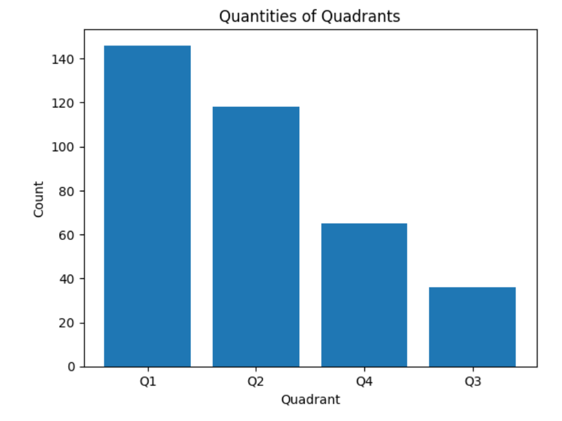

# Identifying Sentiment Trends in Popular Music
This repository aims to analyse the BiMMuda dataset for sentiment, which may be useful in determining if there is any observable trend in the sentiment of popular music across time.

## The Billboard Melodic Music Dataset (BiMMuDa)

This repository is a fork of [The Billboard Melodic Music Dataset](https://github.com/madelinehamilton/), a MIDI dataset of the main melodies of the top five singles from the Billboard Year-End Singles Charts for each year from 1950 to 2022. More information about the project can be found in the Github repository, or in its [associated paper](https://www.nature.com/articles/s41598-024-64571-x).

All files in this repository's "bimmuda" folder are from the original repository. The "bimmuda_remis" folder contains every full MIDI file from the original dataset, converted into a REMI pkl file.

## REvamped MIDI-derived events (REMI)

REMI is a method for encoding symbolic music into text-based musical events for data analysis and use in machine learning. The "utils.py" file in this project's "remi" subfolder is taken from [YatignMusic's REMI repository](https://github.com/YatingMusic/remi). The "midi2remi.py" file in the same folder is an adaptation of the "midi2remi.ipynb" file from [the same source](https://github.com/YatingMusic/remi). More information about the project can be found in its Github repository, or in its [associated paper](https://arxiv.org/abs/2002.00212).

## Extracting Sentiment Features from BiMMuda

Based on the research of [research of Panda et al](https://www.researchgate.net/publication/346359767_Audio_Features_for_Music_Emotion_Recognition_a_Survey), the following features have been identified as suitable for extraction from the melodic files in the BiMMuDa dataset. Features which depend on harmonic complexity or textural information, as well as features which do not have a clear consensus on impact on sentiment, have been omitted. Melodic contour has been omitted from this mini project, as extracting melodic contour is more complex than extracting the remaining sentiment features.

In the following table, quadrants refer to [Russell's Circumplex Model of Affect](https://www.ncbi.nlm.nih.gov/pmc/articles/PMC2367156/). These were determined by identifying which quadrant(s) the language used in describing different musical features were most clearly associated with. More information about the quadrants can be found below.

| Attribute                     | Associated Quadrant(s) | Extraction Method |
| ----------------------------- | ---------------------- | ----------------- |
| High pitch                    | Q1, Q4  (HV)           | Y                 |
| Low pitch                     | Q2, Q3  (LV)           | Y                 |
| Large pitch variation         | Q1 (HVHA)              | Y                 |
| Small pitch variation         | Q3, Q4 (LA)            | Y                 |
| Wide pitch range              | Q1, Q4 (HV)            | Y                 |
| Narrow pitch range            | Q2 (LVHA)              | Y                 |
| Major mode                    | Q1, Q4 (HV)            | N/A               |
| Minor mode                    | Q2, Q3 (LV)            | N/A               |
| Fast tempo, high note density | Q1, Q2 (HA)            | N/A               |
| Slow tempo, low note density  | Q3, Q4 (LA)            | N/A               |

### High Pitch and Low Pitch
Determined as an average pitch from all note events in the file. For the purposes of this project, a MIDI value of 60 (indicating "middle C" on a piano) shall be determined as a threshold. Notes higher than 60 will be considered high pitch, and notes lower than 60 will be considered low pitch. An average pitch will be taken for all pieces of music.

### Wide and Narrow Pitch Variation
Pitch variation refers to the number of unique pitches within a piece. For the purposes of this project, pitches (as opposed to pitch classes) shall be used. Seven or more unique pitches in a melody (seven being the number of pitches in a major or minor scale) shall be considered indication of wide pitch variation.

### Small and Large Pitch Range
For the purposes of this project, a large pitch range shall be any piece where the lowest note is greater than an octave lower than the highest note (lowest note < highest note - 12).

### Major or Minor mode
Modal data is provided in the original BiMMuDa dataset. Since modality is provided per melody in a piece, the modality of a piece shall be expressed as being in the range of -1 to 1, where -1 indicates that all melodies are minor, and 1 indicates that all melodies are major.

### Tempo
Tempo data is provided in the original BiMMuDa dataset. A BPM of 90 or greater (90 being the center of the range for an "andante" or "walking pace" tempo marking) shall be considered "fast".

### Note Density
Note onset density is provided in the original BiMMuDa dataset. A note onset density of 2.5 or greater shall be considered high density. This value is used as manually reviewing the data suggests that it's a central value for the calculated note onset density in the BiMMuDa dataset. The mean of note density in all melodies of a full piece shall be taken.

## Sentiment Quadrants

Based on research by Russell, sentiment is mapped across two dimensions: arousal (or energy) and valence (or how positive/negative the feeling is). This results in four quadrants:
 1. Q1: High arousal, high valence
 2. Q2: High arousal, low valence
 3. Q3: Low arousal, low valence
 4. Q4: Low arousal, high valence

If a sentiment is associated with both Q1 and Q4, it results in a shift towards a positive value on the valence axis; similarly, if a sentiment is associated with both Q3 and Q4, it results in a shift towards a negative value on the arousal axis.

In most cases, an attribute has a clear association with one sentiment axis (e.g. higher pitches in the melody map to high valence, lower pitches map to low valence). There are two exceptions: pitch variation and pitch range. While small pitch variation indicates low arousal, wide pitch variation is associated with both high arousal and high valence. Similarly, a wide pitch range is associated with high valence while a narrow pitch range is associated with low valence and high arousal.

For attributes which clearly map to one axis (e.g. pitch height), they shall impact the sentiment coordinate plotting for that axis only. For attributes which indicate a change in axis on only one side, the attribute shall influence one or two axes depending on its value.

## Initial Results

Initial findings indicate that the most popular quadrant in this dataset is Q1 (high arousal, high valence), with high arousal pieces being more populous than low arousal pieces. There are a few issues with these results, however:

 1. There is no weighting of attributes (relative pitch height is considered as important as piece modality in calculating valence)
 2. Not all attributes have been considered (melodic contour extraction is not yet implemented)
 3. These results are not verified against any other metric (e.g. Spotify data contains sentiment information)
 4. The central value for each attribute (i.e. the value at which an attribute moves from positive to negative) has been determined based on the author's own experience and not on any wider research.

Further investigation is required to assess the accuracy of this sentiment identification methodology. If this data proves accurate, it may be useful in identifying trends over time of sentiment in popular music.
